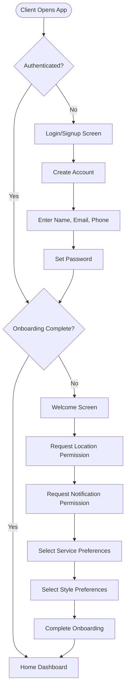
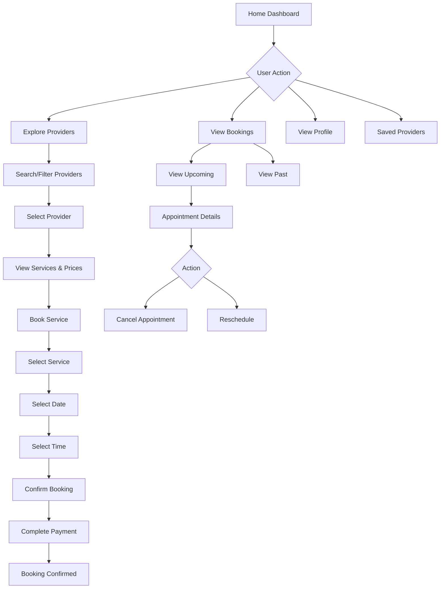
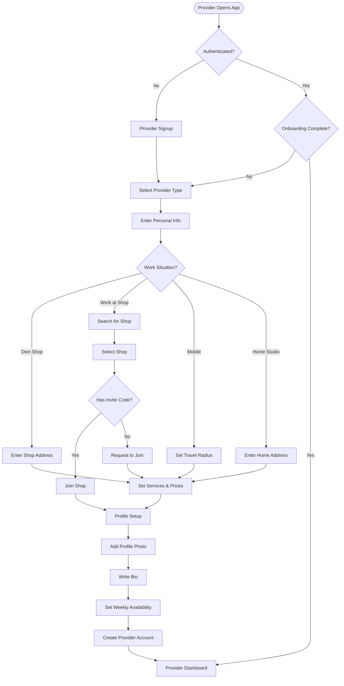
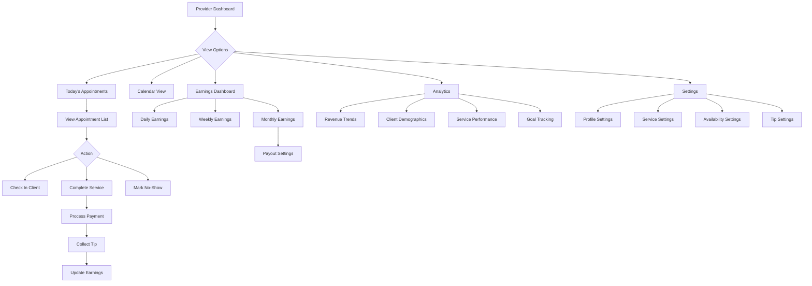
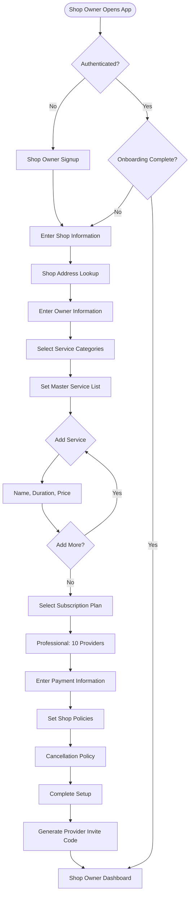

# BookerPro App Process Flows Documentation

## Overview
BookerPro is a comprehensive booking platform that serves three distinct user types:
1. **Clients** - Book services with providers
2. **Providers** - Offer services and manage appointments  
3. **Shop Owners** - Manage multiple providers and shops

## 1. Client User Journey

### Onboarding Flow

### Daily Use Flow

## 2. Provider User Journey

### Onboarding Flow

### Daily Use Flow

## 3. Shop Owner User Journey

### Onboarding Flow

### Daily Use Flow

```mermaid
flowchart TD
    Dashboard[Shop Owner Dashboard] --> ViewMode{View Mode}
    
    ViewMode --> Overview[All Shops Overview]
    ViewMode --> Individual[Individual Shop View]
    
    Overview --> Metrics[Consolidated Metrics]
    Metrics --> TotalRevenue[Total Revenue]
    Metrics --> TotalStylists[Total Stylists]
    Metrics --> TotalAppts[Total Appointments]
    
    Individual --> ShopMetrics[Shop-Specific Metrics]
    ShopMetrics --> ShopRevenue[Shop Revenue]
    ShopMetrics --> ShopTeam[Shop Team]
    ShopMetrics --> ShopCalendar[Shop Calendar]
    
    Dashboard --> TeamMgmt[Team Management]
    TeamMgmt --> InviteProvider[Invite Provider]
    InviteProvider --> GenerateInvite[Generate Invite Code/Link]
    TeamMgmt --> ManageTeam[Manage Team]
    ManageTeam --> ViewProviders[View All Providers]
    ViewProviders --> ProviderAction{Provider Action}
    ProviderAction --> EditPermissions[Edit Permissions]
    ProviderAction --> ViewPerformance[View Performance]
    ProviderAction --> RemoveProvider[Remove Provider]
    
    Dashboard --> BoothRent[Booth Rent System]
    BoothRent --> RentStatus[View Rent Status]
    RentStatus --> PendingRents[Pending Payments]
    RentStatus --> OverdueRents[Overdue Rents]
    PendingRents --> MarkPaid[Mark as Paid]
    OverdueRents --> SendReminder[Send Reminder]
    
    BoothRent --> AutoCalc[Automated Calculation]
    AutoCalc --> RevenueBase[Revenue-Based: 15-25%]
    AutoCalc --> FixedRate[Fixed Rate: $800-1200]
    
    Dashboard --> Analytics[Advanced Analytics]
    Analytics --> RevenueAnalysis[Revenue Analysis]
    Analytics --> TeamPerformance[Team Performance]
    Analytics --> ClientInsights[Client Insights]
    Analytics --> ExportReport[Export Reports]
    
    Dashboard --> ShopSettings[Shop Settings]
    ShopSettings --> EditInfo[Edit Shop Info]
    ShopSettings --> EditServices[Edit Service Menu]
    ShopSettings --> EditPolicies[Edit Policies]
    ShopSettings --> BillingSettings[Billing Settings]
```

## Key Features by User Type

### Client Features
- Browse and search providers
- Book appointments
- Manage bookings (view, cancel, reschedule)
- Save favorite providers
- View appointment history
- Make payments
- Leave reviews

### Provider Features
- Manage daily appointments
- Track earnings and tips
- View analytics and performance metrics
- Set availability
- Manage services and pricing (if independent)
- Process payments
- Goal tracking
- Client management

### Shop Owner Features
- Multi-shop management
- Team management and invitations
- Booth rent system with automation
- Consolidated analytics across shops
- Service menu control
- Subscription management
- Performance tracking
- Revenue optimization tools
- Automated payment reminders
- Advanced reporting

## Technical Implementation Notes

### Authentication & Authorization
- Role-based access control (client, provider, owner)
- Developer mode for testing different user types
- Persistent login state using AsyncStorage

### State Management
- Context providers for each user type's onboarding
- Shared providers for common functionality (auth, bookings, analytics)
- React Query for server state management
- Local state for UI components

### Navigation Structure
- Tab-based navigation for main app sections
- Stack navigation for onboarding flows
- Modal presentations for critical actions
- Deep linking support for provider profiles and bookings

### Data Flow
- Mock data for development/testing
- Prepared for backend integration
- Optimistic updates for better UX
- Offline support with data synchronization

## Testing Different User Flows

To test each user type in development mode:

1. **Enable Developer Mode**: Access through profile settings
2. **Test Accounts Available**:
   - Client: `client@test.com` / `password123`
   - Provider: `provider@test.com` / `password123`
   - Shop Owner: `owner@test.com` / `password123`
3. **Reset Onboarding**: Available in settings to re-test onboarding flows
4. **Mock Data**: Pre-populated for each user type to simulate real usage